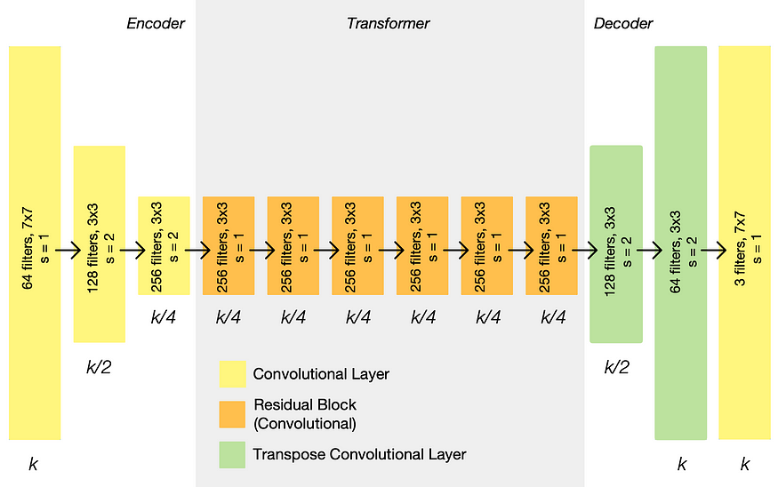
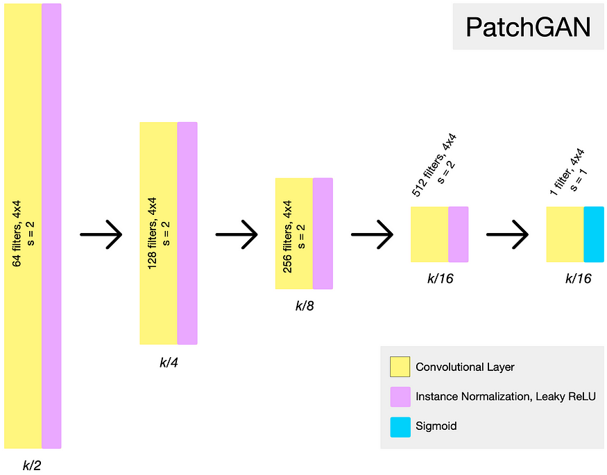
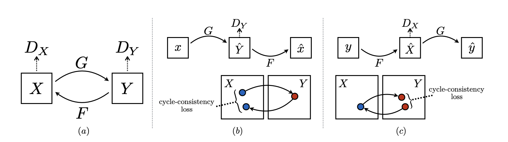

# Problem Formulation

## Data
The data is expected to be organized as a data folder with corresponding subfolders laid out as below:
```
.
├── ...
├── data                    # Data root
│   ├── trainX              # Real images for training
│   ├── trainY              # Ghibli images for training
│   └── testX               # Real images for testing
│   └── testY               # Ghibli images for testing
└── ...
```
The trainX folder contains approximately 1800 authentic landscape images, while the trainY folder is populated with around 900 images in the Ghibli style, collected from various Ghibli movies such as Totoro and The Wind Rises, among others. 

The testX folder was filled with about 700 real landscape images for testing purposes, and the testY folder includes roughly 30 images in the Ghibli style.

## Architecture

### Generator
The architecture of the Generator is something like below. Including down-sampling, up-sampling and some residual blocks.



### Discriminator
The architecture of the Discriminator is something like below. Several convolutional layers.



## Loss

(a) is the high level of the architecture of the CycleGAN, two generators, and two discriminators.
(b) and (c) shows how cycle consistency loss works and where it comes from; it is just the distance between the original data and the data passing through two generators that come back to the domain again. We also need the loss from the discriminators using MSE. Add them up is the final Loss Function; we time λ to the cyc loss.


